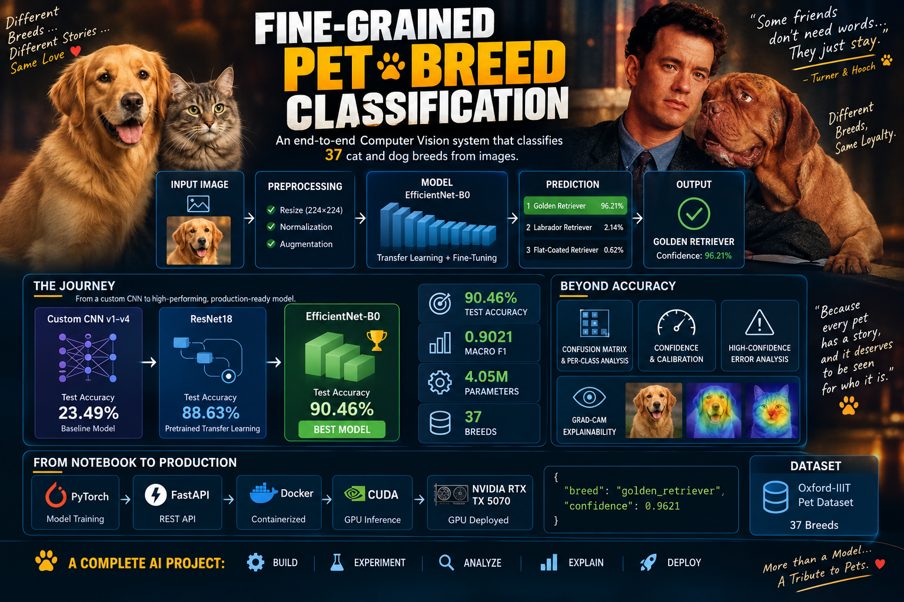
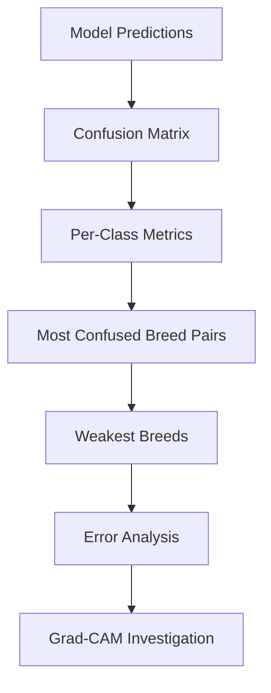
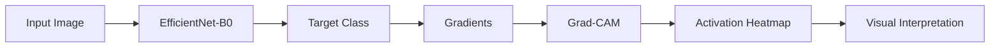
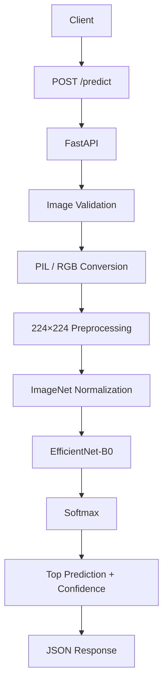

<div align="center">

# 🐾 Fine-Grained Pet Breed Classification

### End-to-End Computer Vision & Deep Learning Engineering Project

**37-breed cat & dog image classification — from dataset analysis and custom CNN research to transfer learning, explainability, FastAPI, Docker, and GPU-accelerated production inference.**

<br>


<br>

<p align="center">
  
</p>

### 🏆 Final Model

**EfficientNet-B0 · 90.46% Test Accuracy · 0.9021 Macro F1 · 4.05M Parameters**

</div>

---

# 📑 Table of Contents

- [🎯 Project Overview](#-project-overview)
- [💡 Why This Project](#-why-this-project)
- [🏆 Final Results](#-final-results)
- [🧭 End-to-End Workflow](#-end-to-end-workflow)
- [🧠 Model Development Journey](#-model-development-journey)
- [🧪 CNN Improvement Experiments](#-cnn-improvement-experiments)
- [🔬 Transfer Learning](#-transfer-learning)
- [📊 Evaluation & Error Analysis](#-evaluation--error-analysis)
- [👁️ Grad-CAM Explainability](#️-grad-cam-explainability)
- [🏭 Production Architecture](#-production-architecture)
- [⚡ GPU Inference](#-gpu-inference)
- [🚀 FastAPI](#-fastapi)
- [🐳 Docker](#-docker)
- [📁 Repository Structure](#-repository-structure)
- [🛠️ Technology Stack](#️-technology-stack)
- [🐱🐶 Dataset & Classes](#-dataset--classes)
- [📓 Notebook Structure](#-notebook-structure)
- [▶️ Run the Project](#️-run-the-project)
- [📡 API Examples](#-api-examples)
- [🧠 Key Technical Findings](#-key-technical-findings)
- [📈 Future Improvements](#-future-improvements)
- [👨‍💻 Author](#-author)

---

# 🎯 Project Overview

This project is a **fine-grained image classification system** designed to identify the breed of a cat or dog from an input image.

The task is intentionally more challenging than ordinary image classification: many breeds share similar visual characteristics, so the model must learn subtle patterns in:

- Facial structure
- Ear shape
- Fur texture
- Coat pattern
- Body proportions
- Color distribution
- Head shape
- Breed-specific visual cues

The project was developed as a complete computer-vision workflow rather than a single training experiment.

```text
┌──────────────────────────────────────────────────────────────┐
│                 FINE-GRAINED PET CLASSIFIER                  │
├──────────────────────────────────────────────────────────────┤
│                                                              │
│  Data Understanding                                          │
│       ↓                                                      │
│  EDA + Data Quality                                          │
│       ↓                                                      │
│  Train / Validation / Test Split                             │
│       ↓                                                      │
│  Preprocessing + Augmentation                                │
│       ↓                                                      │
│  Baseline CNN                                                │
│       ↓                                                      │
│  CNN Architecture Experiments → Improved CNN v4              │
│       ↓                                                      │
│  ResNet18 Transfer Learning                                  │
│       ↓                                                      │
│  EfficientNet-B0 Fine-Tuning                                 │
│       ↓                                                      │
│  Controlled Evaluation                                       │
│       ↓                                                      │
│  Error Analysis + Confusion Matrix + Calibration             │
│       ↓                                                      │
│  Grad-CAM Explainability                                     │
│       ↓                                                      │
│  FastAPI Inference                                           │
│       ↓                                                      │
│  Docker + NVIDIA GPU                                         │
│                                                              │
└──────────────────────────────────────────────────────────────┘
```

The important part is that the project does **not** stop at:

> "I trained a CNN and got an accuracy score."

It continues through **model diagnosis, comparison, interpretability, API engineering, containerization, and real GPU inference**.

---

# 💡 Why This Project

A production-oriented computer-vision system needs more than a good training score.

This project therefore answers five different questions:

| Question | Project Component |
|---|---|
| Can we understand the data? | EDA + Data Quality Audit |
| Can we build a strong baseline? | Custom CNN |
| Can we systematically improve it? | CNN Experiments |
| Can transfer learning outperform our custom model? | ResNet18 + EfficientNet-B0 |
| Can the final model actually be used? | Grad-CAM + FastAPI + Docker + CUDA |

---

# 🏆 Final Results

Three major model families were compared under the final evaluation workflow.

| Rank | Model | Test Accuracy ↑ | Macro F1 ↑ | Parameters ↓ | Inference / Image |
|---|---|---:|---:|---:|---:|
| 🥇 | **EfficientNet-B0** | **90.46%** | **0.9021** | **4,054,945** | **2.782 ms** |
| 🥈 | ResNet18 | 88.63% | 0.8844 | 11,195,493 | 2.665 ms |
| 🥉 | Custom CNN v4 | 23.49% | 0.2236 | 12,943,461 | 2.729 ms |

### 📈 Improvement

EfficientNet-B0 improved test accuracy by:

```text
+66.97 percentage points
```

over Custom CNN v4.

Compared with ResNet18:

```text
+1.83 percentage points
```

in test accuracy.

### ⚙️ Efficiency

EfficientNet-B0 also uses dramatically fewer parameters than the custom CNN v4:

```text
Custom CNN v4   : 12.94M
ResNet18        : 11.20M
EfficientNet-B0 :  4.05M
```

That combination of **accuracy + Macro F1 + parameter efficiency** is the main reason EfficientNet-B0 was selected as the final production model.

---

# 🧭 End-to-End Workflow


---

# 🧠 Model Development Journey

The project deliberately started with a **custom CNN** before moving to pretrained architectures.

This made it possible to establish a baseline and investigate what architecture changes could — and could not — achieve.

## Evolution

```text
Baseline CNN
      │
      ▼
Improved CNN v1
      │
      ▼
Improved CNN v2
      │
      ▼
Improved CNN v3
      │
      ▼
Improved CNN v4
      │
      ├──────────────► ResNet18
      │
      └──────────────► EfficientNet-B0
                              │
                              ▼
                         Final Model
```

The earlier CNN versions were intentionally condensed in the final notebook narrative.

Instead of filling the notebook with every intermediate experiment and repeated output, the project keeps the **experimental conclusion** and focuses the detailed analysis on the final selected configuration.

### Final custom CNN

**Improved CNN v4** became the strongest custom-CNN configuration and served as the reference point for the later controlled experiments.

---

# 🧪 CNN Improvement Experiments

The CNN stage was not a single architecture change.

```
Improved CNN v4
      │
      ├── Parameter Update Checks
      ├── BatchNorm Running Statistics
      │
      ├── Dropout Experiment
      ├── BatchNorm Ablation
      ├── Weight Decay Experiment
      ├── Learning Rate Experiment
      ├── Adam vs SGD
      ├── Class Imbalance Experiment
      │
      └── Controlled CNN Comparison
```

# 🔬 Transfer Learning

After establishing the custom CNN benchmark, pretrained architectures were evaluated.

## ResNet18

ResNet18 substantially improved over the custom CNN.

```text
Test Accuracy : 88.63%
Macro F1      : 0.8844
Parameters    : 11,195,493
```

## EfficientNet-B0

EfficientNet-B0 was then fine-tuned for the 37-class classification problem.

### Fine-tuning configuration

| Setting | Value |
|---|---|
| Architecture | EfficientNet-B0 |
| Input Size | 224 × 224 |
| Classes | 37 |
| Backbone | Trainable |
| Classifier | Trainable |
| Optimizer | Adam |
| Learning Rate | 0.0001 |
| Epochs | 10 |
| Device | CUDA |

### Best validation checkpoint

```text
Best Validation Accuracy : 93.48%
Best Validation Loss     : 0.2821
Best Epoch               : 5
```

---

# 🏅 Why EfficientNet-B0 Won

The final decision was not based on accuracy alone.

EfficientNet-B0 delivered the best combination of:

```text
          ┌─────────────────────┐
          │   Test Accuracy     │
          │       90.46%        │
          └──────────┬──────────┘
                     │
       ┌─────────────┼─────────────┐
       ▼             ▼             ▼
  Macro F1      Parameters      Inference
   0.9021         4.05M          2.78 ms
       │             │             │
       └─────────────┼─────────────┘
                     ▼
              FINAL SELECTION
```

It outperformed ResNet18 while requiring only about **36% of its parameter count**.

---

# 📊 Evaluation & Error Analysis

The project does not treat test accuracy as the only definition of model quality.

The final evaluation includes:

### Classification Metrics

- Accuracy
- Macro Precision
- Macro Recall
- Macro F1

### Diagnostic Analysis

- Confusion Matrix
- Per-Class Accuracy
- Per-Class F1
- Most Confused Breed Pairs
- Weakest Performing Breeds
- Strongest Performing Breeds
- Prediction Confidence Distribution
- Calibration Analysis
- Expected Calibration Error
- Reliability Diagram
- High-Confidence Errors

### Why this matters

A model can achieve a strong global accuracy while still performing poorly on a small group of visually similar breeds.

Per-class analysis exposes those weaknesses.

---

# 🔀 Confusion Analysis

The confusion-matrix analysis was used to identify which breeds were most frequently confused.

The workflow was:



This connects quantitative errors with visual evidence.

---

# 👁️ Grad-CAM Explainability

Grad-CAM was applied to the final EfficientNet-B0 model to inspect **where the network was looking** when producing predictions.

## Explainability workflow



The analysis focuses on:

### Correct predictions

Does the model focus on meaningful animal regions?

### Incorrect predictions

Does the model focus on:

- Background
- Irrelevant objects
- Wrong body regions
- Pose-dependent features
- Features shared by multiple breeds

### High-confidence mistakes

These are particularly important because they reveal cases where the model is **confidently wrong**, not merely uncertain.

---

# 🏭 Production Architecture

The final model was moved from notebook experimentation into a real inference service.



### Production separation

```text
Training / Research
        │
        ▼
    Notebook
        │
        ▼
 Best Checkpoint
        │
        ▼
Production Inference
        │
        ▼
     FastAPI
        │
        ▼
      Docker
        │
        ▼
   NVIDIA GPU
```

---

# ⚡ GPU Inference

The production container was explicitly tested with NVIDIA GPU access.

### Verified environment

```text
PyTorch : 2.12.0+cu130
CUDA    : 13.0
GPU     : NVIDIA GeForce RTX 5070 Laptop GPU
```

Inside the running Docker container:

```text
CUDA available : True
GPU            : NVIDIA GeForce RTX 5070 Laptop GPU
Model device   : cuda:0
```

This was verified directly from inside the running container.

### GPU runtime

```bash
docker run --rm --gpus all -p 8000:8000 pet-breed-api
```

The important distinction is:

```text
Host GPU
   ↓
Docker GPU Access
   ↓
CUDA available = True
   ↓
PyTorch CUDA
   ↓
EfficientNet-B0 on cuda:0
```

---

# 🚀 FastAPI

The production API exposes two main endpoints.

| Method | Endpoint | Purpose |
|---|---|---|
| `GET` | `/health` | Health and model/device status |
| `POST` | `/predict` | Breed prediction |

---

```json
{
  "status": "ok",
  "model": "EfficientNet-B0",
  "device": "cuda",
  "classes": 37
}
```

## Prediction endpoint

Example verified prediction:

```json
{
  "breed": "scottish_terrier",
  "confidence": 0.9532
}
```

The API accepts:

```text
JPEG
PNG
WEBP
BMP
TIFF
GIF
```

and validates:

- Filename
- MIME type
- Empty uploads
- Image decoding
- Corrupted image files
- RGB conversion

---

# 🐳 Docker

The application is packaged as a Docker image.

## Build

```bash
docker build -t pet-breed-api .
```

## Run with GPU

```bash
docker run --rm --gpus all -p 8000:8000 pet-breed-api
```

## Expected startup

```text
Fine-Grained Pet Breed Classification API

Model       : EfficientNet-B0
Checkpoint  : /app/notebooks/models/best_model.pth
Device      : cuda
Classes     : 37
Model       : Ready

Uvicorn running on http://0.0.0.0:8000
```

## Verify container

```bash
docker ps
```

## Verify GPU inside container

```bash
docker exec <container_id> python -c "import torch; print(torch.cuda.is_available()); print(torch.cuda.get_device_name(0))"
```

Expected:

```text
True
NVIDIA GeForce RTX 5070 Laptop GPU
```

---

# 📁 Repository Structure

```text
Fine-Grained Pet Breed Classification/
│
├── app/
│   ├── __pycache__/
│   └── app.py
│
├── artifacts/
│   ├── splits/
│   ├── baseline_cnn_best.pth
│   ├── improved_cnn_best.pth
│   ├── improved_cnn_v2_best.pth
│   ├── improved_cnn_v3_best.pth
│   └── improved_cnn_v4_best.pth
│
├── data/
│   ├── processed/
│   ├── raw/
│   └── splits/
│
├── notebooks/
│   ├── models/
│   │   ├── batchnorm_ablation_best.pth
│   │   ├── efficientnet_b0_finetuned_best.pth
│   │   ├── resnet18_feature_extraction_best.pth
│   │   └── resnet18_finetuned_best.pth
│   │
│   └── Fine-Grained Pet Breed Classification.ipynb
│
├── .dockerignore
├── Dockerfile
├── README.md
└── requirements.txt
```

### Artifact organization

The repository separates:

```text
artifacts/
    Custom CNN checkpoints
        ↓
notebooks/models/
    Transfer-learning / experiment checkpoints
        ↓
production checkpoint
    best_model.pth
```

This preserves the experimental history without turning the production application into a notebook-dependent system.

---

# 🛠️ Technology Stack

| Category | Technologies |
|---|---|
| Language | Python 3.13 |
| Deep Learning | PyTorch 2.12.0 |
| Computer Vision | Torchvision, Pillow |
| Numerical Computing | NumPy |
| Data Analysis | Pandas |
| Visualization | Matplotlib |
| Classical ML | Scikit-learn |
| Models | Custom CNN, ResNet18, EfficientNet-B0 |
| Explainability | Grad-CAM |
| API | FastAPI |
| Server | Uvicorn |
| Validation | FastAPI / Pydantic |
| Containerization | Docker |
| GPU | NVIDIA RTX 5070 Laptop GPU |
| Acceleration | CUDA 13.0 |
| Experimentation | Jupyter Notebook |
| Version Control | Git / GitHub |

---

# 🐱🐶 Dataset & Classes

The final classifier predicts **37 pet breeds**.

## Cat breeds

```text
Abyssinian
Bengal
Birman
Bombay
British_Shorthair
Egyptian_Mau
Maine_Coon
Persian
Ragdoll
Russian_Blue
Siamese
Sphynx
```

## Dog breeds

```text
american_bulldog
american_pit_bull_terrier
basset_hound
beagle
boxer
chihuahua
english_cocker_spaniel
english_setter
german_shorthaired
great_pyrenees
havanese
japanese_chin
keeshond
leonberger
miniature_pinscher
newfoundland
pomeranian
pug
saint_bernard
samoyed
scottish_terrier
shiba_inu
staffordshire_bull_terrier
wheaten_terrier
yorkshire_terrier
```

---

# 📓 Notebook Structure

The notebook is organized as a complete experimental narrative.

```text
01  Project Overview
02  Environment & Configuration
03  Dataset Loading & Exploration
04  Image Data Understanding
05  Exploratory Data Analysis
06  Data Quality Audit
07  Train / Validation / Test Split
08  Image Preprocessing
09  Data Augmentation
10  PyTorch Dataset & DataLoader

11  Baseline CNN Architecture
12  CNN Training
13  Baseline CNN Evaluation
14  Training Analysis & Learning Curves

15  CNN Improvement Experiments
    ├── Iterative Architecture Experiments
    ├── Improved CNN v4
    ├── Forward Pass Verification
    ├── Classifier Activation Verification
    ├── Training Diagnosis
    ├── Dropout Experiment
    ├── BatchNorm Ablation
    ├── Weight Decay Experiment
    ├── Learning Rate Experiment
    ├── Adam vs SGD
    ├── Class Imbalance
    └── Controlled Comparison

16  CNN Error Analysis
17  Transfer Learning with ResNet18
18  EfficientNet-B0 — Controlled Experiments
19  Final Model Selection
20  Grad-CAM & Error Analysis
21  Production Inference
```

The notebook intentionally preserves the **reasoning behind the final model**, not just the final score.

---

# 🔍 Production Preprocessing

The production inference pipeline mirrors the final model's expected input representation.

```text
 Uploaded Image
      ↓
PIL Image Validation
      ↓
 RGB Conversion
      ↓
Resize 224 × 224
      ↓
   ToTensor
      ↓
ImageNet Normalization
      ↓
Batch Dimension
      ↓
     CUDA
      ↓
EfficientNet-B0
```

Normalization:

```python
mean = [0.485, 0.456, 0.406]
std  = [0.229, 0.224, 0.225]
```

---

# 🧠 Key Technical Findings

## 1. Custom CNN was a useful baseline — but not the final solution

The custom CNN experiments were valuable because they exposed training and generalization limitations before introducing pretrained backbones.

## 2. Transfer learning changed the performance ceiling

The jump from:

```text
Custom CNN v4  →  ResNet18
23.49%            88.63%
```

was substantial.

The improvement demonstrated the value of pretrained visual representations for this fine-grained classification problem.

## 3. EfficientNet-B0 achieved the best final result

```text
90.46% Accuracy
0.9021 Macro F1
```

while using only:

```text
4.05M parameters
```

## 4. Fine-grained classification requires class-level analysis

Overall accuracy alone does not reveal which breeds are difficult.

Confusion matrices, per-class metrics, confidence analysis, and Grad-CAM provide the missing diagnostic layer.

## 5. Deployment is part of the project

The final result is not just a `.pth` checkpoint.

It is:

```text
Model
+
Preprocessing
+
Validation
+
API
+
Docker
+
CUDA
+
GPU
```

---

# 🧪 Verified Production Test

The complete production path was tested:

```text
Docker Container
      ↓
CUDA Available
      ↓
EfficientNet-B0 on cuda:0
      ↓
POST /predict
      ↓
Image Upload
      ↓
Prediction
```

Example:

```json
{
  "breed": "scottish_terrier",
  "confidence": 0.9532
}
```

The service returned HTTP `200` for the prediction request.

---

# ▶️ Run the Project

## 1. Clone

```bash
git clone https://github.com/morsycoo/Fine-Grained-Pet-Breed-Classification
cd "Fine-Grained Pet Breed Classification"
```

## 2. Create virtual environment

```bash
python -m venv .venv
```

Windows:

```powershell
.venv\Scripts\Activate.ps1
```

## 3. Install dependencies

```bash
pip install -r requirements.txt
```

## 4. Open the notebook

```text
notebooks/Fine-Grained Pet Breed Classification.ipynb
```

## 5. Build the production image

```bash
docker build -t pet-breed-api .
```

## 6. Run with GPU

```bash
docker run --rm --gpus all -p 8000:8000 pet-breed-api
```

## 7. Open Swagger

```text
http://127.0.0.1:8000/docs
```

---

# 📡 API Examples

## Health Check

```bash
curl.exe http://127.0.0.1:8000/health
```

Response:

```json
{
  "status": "ok",
  "model": "EfficientNet-B0",
  "device": "cuda",
  "classes": 37
}
```

## Prediction

From Swagger:

```text
POST /predict
→ Try it out
→ Choose File
→ Execute
```

Example response:

```json
{
  "breed": "scottish_terrier",
  "confidence": 0.9532
}
```

---

# 🧰 Engineering Checklist

| Component | Status |
|---|:---:|
| Dataset exploration | ✅ |
| Data quality audit | ✅ |
| Train / validation / test split | ✅ |
| Image preprocessing | ✅ |
| Data augmentation | ✅ |
| Baseline CNN | ✅ |
| CNN architecture experiments | ✅ |
| Improved CNN v4 | ✅ |
| Dropout experiment | ✅ |
| BatchNorm ablation | ✅ |
| Weight decay experiment | ✅ |
| Learning-rate experiment | ✅ |
| Adam vs SGD | ✅ |
| Class imbalance analysis | ✅ |
| ResNet18 transfer learning | ✅ |
| EfficientNet-B0 fine-tuning | ✅ |
| Controlled model comparison | ✅ |
| Per-class analysis | ✅ |
| Confusion matrix analysis | ✅ |
| Confidence / calibration analysis | ✅ |
| Grad-CAM | ✅ |
| FastAPI | ✅ |
| Docker | ✅ |
| CUDA | ✅ |
| NVIDIA GPU inference | ✅ |

---

# 📈 Future Improvements

Potential next steps:

- Top-k predictions
- Confidence thresholding
- Batch prediction endpoint
- Prediction history
- API authentication
- Automated unit and integration tests
- CI/CD
- Model versioning
- Model monitoring
- Inference latency monitoring
- Cloud deployment
- Model optimization / quantization
- Automated retraining
- Data drift detection
- Better handling of visually ambiguous breeds

---

# 👨‍💻 Author

## Mahmoud Morsy

**AI Engineer / Machine Learning Engineer**

This project was designed and implemented as an end-to-end computer-vision engineering project, covering:

```text
Deep Learning
+
Computer Vision
+
Model Experimentation
+
Statistical Evaluation
+
Explainability
+
API Engineering
+
Containerization
+
GPU Deployment
```
### Connect with me

- GitHub: https://github.com/morsycoo
- LinkedIn: https://linkedin.com/in/mahmudmursi
- Kaggle: https://kaggle.com/mahmoudmorsy

---

# ⭐ Project Philosophy

> **Don't just train a model. Understand why it works, understand why it fails, compare alternatives, explain its decisions, and make it deployable.**

That is the difference between a notebook experiment and an **end-to-end AI system**.

---

<div align="center">

## 🐾 From Images → Intelligence → Production

**Fine-Grained Pet Breed Classification**

### EfficientNet-B0 · 90.46% Test Accuracy · 0.9021 Macro F1
This investigation eventually led to the **Improved CNN v4** configuration.

</div>

